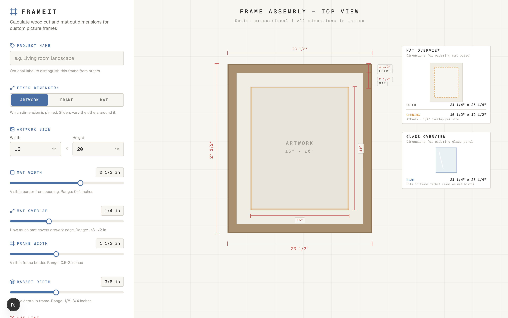

# FRAMEIT

A picture frame calculator that computes wood cut dimensions for custom frames. Pin whichever dimension you already have — artwork, frame, or mat board — and get an instant cut list with an interactive assembly diagram for everything else.

Live at **[frameit.happilynerdy.com](https://frameit.happilynerdy.com)**.



## Features

- **Three input modes** — pin the dimension you already know and let the rest flow:
  - **Artwork** — you know the art size; compute the mat, glass, and frame to build around it.
  - **Frame outer** — you already have a frame; compute the mat/glass to order and the artwork size that fits.
  - **Mat board** — you already have a mat; compute the frame outer dimensions to build.
- Switch modes without losing your design — the diagram stays pinned while the inputs re-seed from current geometry
- "Fits artwork" readout in frame/mat modes so you can see at a glance what artwork size each combination supports
- Inline warning when mat/frame settings leave no room for any artwork
- Adjustable mat width, mat overlap, frame width, and rabbet depth via sliders (they vary the free dimensions around whichever one you've pinned)
- Real-time cut list: long/short side lengths, miter angle, outer dimensions, total lumber
- Interactive SVG diagram showing frame assembly top-down view with dimension annotations and corner detail
- Optional project name and local persistence so your last frame is waiting when you come back

## Tech Stack

Next.js 16, React 19, TypeScript, Tailwind CSS 4

## Getting Started

```bash
npm install
npm run dev
```

Open [http://localhost:3000](http://localhost:3000) in your browser.

## Build

```bash
npm run build
```

Produces a static site in `out/` (configured via `output: "export"` in `next.config.ts`). Preview it locally with any static server, e.g. `npx serve out`.

## Deployment

Hosted on Firebase Hosting. Pushes to `main` auto-deploy via GitHub Actions (`.github/workflows/firebase-hosting-merge.yml`); pull requests get preview URLs via `.github/workflows/firebase-hosting-pull-request.yml`. To deploy manually:

```bash
npm run deploy
```
